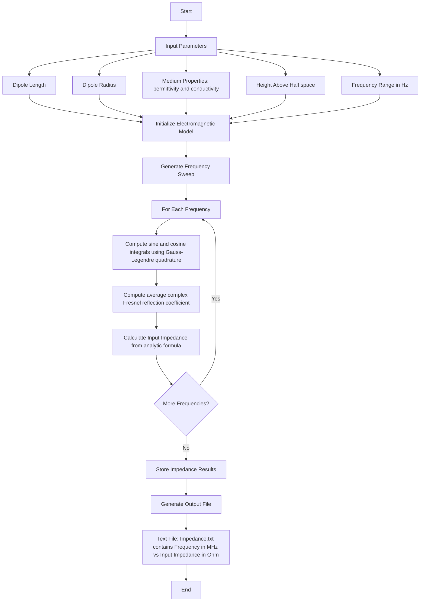

# Analytical Model

## ✨ Info
- **Analytical model** available in code file `analytical.py`
- **Analytical Determination of input impedance of half-wave dipole in free space and half-space**
- **Code diagrams** for visual understanding of input data and output files
- **Good luck, Author: Josip Salinovic**

## 📊 Flowchart

